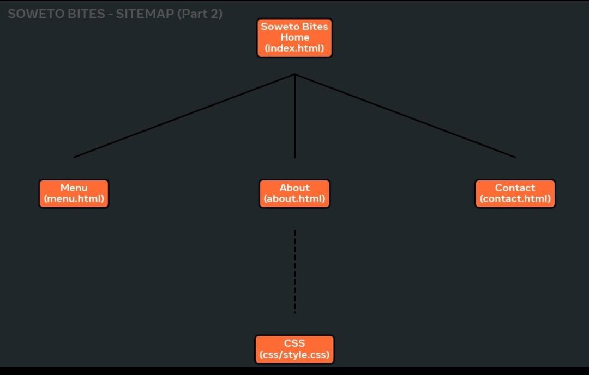

# SowetoBites - Community Food & Culture Website

## Student Details
**Name:** Thabane Makoro
**Student No:** ST1049766
**Course:** WD101 - Web Development Fundamentals
**GitHub Pages Live Link:** https://[your-username].github.io/SowetoBites-main/

## Project Description
SowetoBites is a community-focused website celebrating Soweto's food culture. The purpose is to act as an online guide where tourists, students and locals can discover authentic foods like Kota (R45), Shisa Nyama (R85) and Magwinya (R15), find trusted vendors in Vilakazi Street area, and support small businesses. Built with HTML5 semantic elements and external CSS3.

## Website Structure and Planning
**Sitemap:**
The site has 5 pages all linked from Home:
- Home (index.html) -> About, Products, Enquiry, Contact
- All pages share same header/footer and css/style.css

**Planning:**
- Target audience: Local residents, students, tourists visiting Johannesburg
- Goal: Promote local culture and create job opportunities

## Folder Structure
- index.html, about.html, products.html, enquiry.html, contact.html - Main pages
- css/style.css - External stylesheet (CSS Reset, Typography, Grid/Flexbox, Media Queries)
- images/ - Business images optimized with srcset (480w, 800w, 1200w)
- README.md - Project documentation
- CHANGELOG.md - Record of development and feedback fixes

## Features and Functionality
- Responsive design: Desktop 3-column Grid -> Tablet 2-column -> Mobile 1-column
- Flexbox navigation
- Responsive images using srcset and sizes attributes
- Visual styles: box-shadow, border, hover effects, focus states
- Relative units: %, em, rem used throughout

## Technologies Used
- HTML5 (semantic: header, nav, main, footer)
- CSS3 (Flexbox, Grid, Media Queries, Pseudo-classes :hover :focus :active)
- GitHub for version control with descriptive commits

## How to Run / View Website
1. Clone repo or download ZIP
2. Open index.html in browser OR use VS Code Live Server
3. Navigate via header menu

## Screenshots - Responsive Evidence (Required for Part 2)
### Desktop (1200px)
[Screenshot to be added]

### Tablet (768px)
[Screenshot to be added - layout changes to 2 columns]

### Mobile (480px)
[Screenshot to be added - layout changes to single column, nav becomes column]

## Changelog - Record of Development and Feedback Fixes
### [2.0] - 2026-09-02 - Part 2: Designing Visuals
- Added CSS Reset for consistent styling across browsers
- Added Typography styles with font-family, line-height, letter-spacing, text-transform
- Added Layout structure using Flexbox (header) and Grid (products)
- Added Visual styles: color, background, border, box-shadow
- Added Breakpoints: @media 768px and 480px for responsive
- Added Relative units: % for width, rem/em for fonts/padding
- Added Responsive images: srcset, sizes, picture element
- Added HTML comments explaining structure

### [1.1] - 2026-09-02 - Fixes from Part 1 Feedback (Lecturer Rubric)
- FIXED 0/5 Changelog: Created CHANGELOG.md file
- FIXED 0/5 Sitemap: Created sitemap.png and sitemap.xml
- FIXED 0/5 Comments: Added <!-- comments --> to all HTML files
- FIXED 0/5 References: Added reference list below
- FIXED 1-2/5 README: Expanded from 15 lines to comprehensive doc with sitemap, tech, screenshots
- FIXED 2/10 Content Research: Added real descriptions, prices, vendor locations

### [1.0] - Initial Part 1 Submission
- Created 5 HTML pages, basic style.css

## References
- South African History Online. (2024). Soweto. Available at: https://www.sahistory.org.za
- The IIE. (2026). WD101 Learning Unit 2: CSS Styling.
- Images: Pexels.com and Unsplash.com - Free license images of South African food.
- Mozilla Developer Network. (2024). Responsive images srcset.

## Licence
Educational project for IIE WD101.
